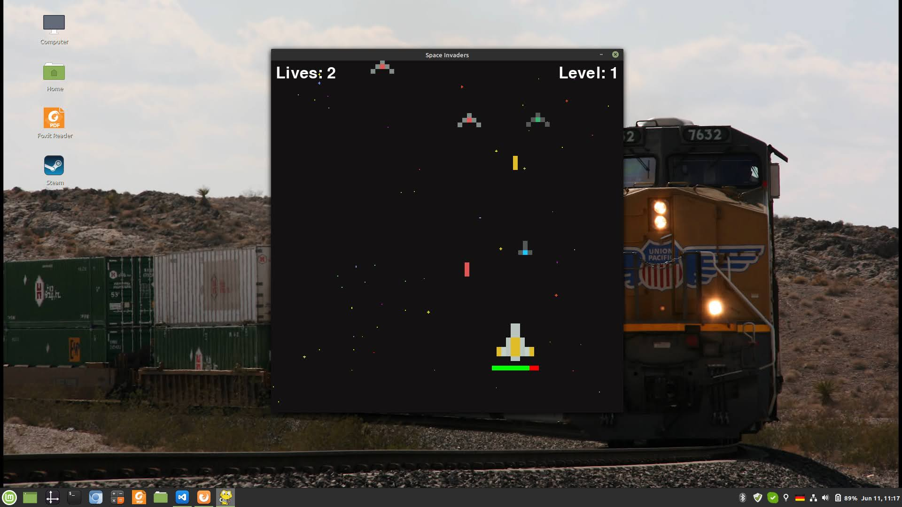

# space invaders



## Usage

This is the classic game of space invaders. To play, open terminal and run, 

```
pip install -r requirements.txt
python space_invaders.py
```

This will case a new window to pop-up. The player ship is on the bottom and enemy ships attack from the top. Play using the up-down-left-right arrow keys. Use spacebar to shoot.

There are several parameters that can be modified in SpaceInvadersGame.__init__() - player/enemy ship speed, number of frames per second, game window size. It is a toy game which has been on my list of things to make, and here it is. 

## Setup
Built with:
* python 3.9.5
* numpy 1.20.3
* pygame 2.0.1

It should be compatible with any python3 but I haven't tested it (and won't) so your milage my vary. 

If there are any issues feel free to let me know, either by opening an issue or emailing me at prabhatreddyk@gmail.com. Enjoy!